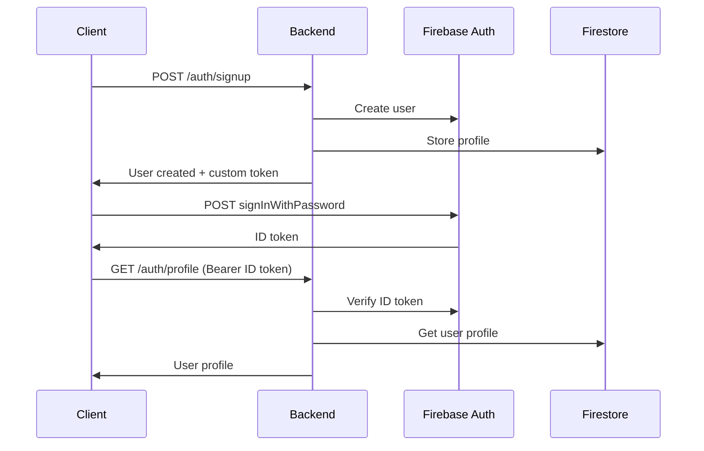

# Firebase ID Token Migration

This document outlines the migration from custom tokens to Firebase ID tokens for authentication.

## 🔄 Changes Made

### 1. Backend Controller Updates (`controllers/authController.js`)

#### Login Endpoint Changes
- **Before**: Returned custom token from Firebase Admin SDK
- **After**: Does NOT return custom token, only confirms user exists
- **New Behavior**: 
  - Validates credentials via Firebase Auth REST API
  - Returns user profile data
  - Provides Firebase Auth URL for client to get ID token
  - Message: "Login successful - use Firebase Auth REST API to get ID token"

#### Profile Endpoint (Unchanged)
- Still uses `admin.auth().verifyIdToken(idToken)` to validate
- Accepts ID token from `Authorization: Bearer <idToken>` header
- Returns user profile from Firestore

### 2. Environment Variables

#### Updated Variable Name
- **Before**: `FIREBASE_WEB_API_KEY`
- **After**: `FIREBASE_API_KEY`

#### Required Environment Variables
```env
FIREBASE_API_KEY=your_firebase_web_api_key_here
FIREBASE_PROJECT_ID=rotidote-database
GOOGLE_APPLICATION_CREDENTIALS=path/to/serviceAccountKey.json
```

### 3. Test Files Updated

All test files now use Firebase Auth REST API to get ID tokens:

#### `test-auth.js`
- Uses Firebase Auth REST API for login
- Gets ID token from Firebase response
- Uses ID token for profile endpoint
- Tests invalid token rejection

#### `quick-test.js`
- Updated to use Firebase ID tokens
- Tests complete authentication flow
- Validates token-based profile access

#### `test-scaffold.js`
- Updated to use Firebase ID tokens
- Tests scaffolded authentication system
- Validates end-to-end flow

## 🔐 Authentication Flow

### New Flow with Firebase ID Tokens



### Step-by-Step Process

1. **Signup**: Client calls `/auth/signup` → Backend creates user in Firebase Auth + Firestore
2. **Login**: Client calls Firebase Auth REST API directly to get ID token
3. **Profile Access**: Client uses ID token in Authorization header for `/auth/profile`

## 🧪 Testing

### Test Commands

```bash
# Test with Firebase ID tokens
npm run test:auth:simple:local
npm run test:quick:local
npm run test:scaffold:local

# All tests now require FIREBASE_API_KEY
FIREBASE_API_KEY=your_key npm run test:auth:simple:local
```

### Test Flow

1. **Signup Test**: Creates user via `/auth/signup`
2. **Firebase Login**: Uses Firebase Auth REST API to get ID token
3. **Profile Test**: Uses ID token to access `/auth/profile`
4. **Invalid Token Test**: Verifies invalid tokens are rejected

## 🔧 Implementation Details

### Firebase Auth REST API Usage

```javascript
const firebaseAuthUrl = `https://identitytoolkit.googleapis.com/v1/accounts:signInWithPassword?key=${FIREBASE_API_KEY}`;

const response = await axios.post(firebaseAuthUrl, {
  email: email,
  password: password,
  returnSecureToken: true
});

const idToken = response.data.idToken;
```

### ID Token Validation

```javascript
// In profile endpoint
const decodedToken = await auth.verifyIdToken(token);
const userId = decodedToken.uid;
```

### Error Handling

- **Invalid Token**: Returns 401 with "Invalid token" message
- **Expired Token**: Returns 401 with "Token expired" message
- **Missing Token**: Returns 401 with "Authentication token required" message

## 🚀 Benefits

### Security Improvements
- **Real Firebase ID Tokens**: Uses official Firebase authentication tokens
- **Token Expiration**: ID tokens have built-in expiration
- **Firebase Validation**: Tokens are validated by Firebase Admin SDK
- **No Custom Token Logic**: Removes custom token creation complexity

### Client-Side Benefits
- **Standard Firebase Flow**: Clients use standard Firebase Auth methods
- **Token Refresh**: Firebase handles token refresh automatically
- **Better Integration**: Works seamlessly with Firebase SDKs

### Backend Benefits
- **Simplified Logic**: No custom token creation needed
- **Firebase Validation**: Leverages Firebase's token validation
- **Standard Patterns**: Follows Firebase best practices

## 🔍 Verification

### Expected Test Results

```bash
🧪 Testing Authentication Endpoints with Firebase ID Tokens...

1️⃣ Testing Signup...
✅ Signup successful: { userId: 'abc123', email: 'test@example.com', profileComplete: true }

2️⃣ Testing Login via Firebase Auth REST API...
✅ Firebase Auth login successful: { userId: 'abc123', hasIdToken: true }

3️⃣ Testing Profile with ID Token...
✅ Profile fetch successful: { userId: 'abc123', name: 'Test User', profileComplete: true }

4️⃣ Testing Backend Login Endpoint...
✅ Backend login successful: { userId: 'abc123', message: 'Login successful - use Firebase Auth REST API to get ID token' }

5️⃣ Testing Invalid Token...
✅ Invalid token correctly rejected: Invalid token

🎉 All authentication tests completed successfully!
```

### Manual Testing

```bash
# 1. Signup
curl -X POST http://localhost:3000/auth/signup \
  -H "Content-Type: application/json" \
  -d '{"email":"test@example.com","password":"password123","name":"Test User","grade":"10","section":"A","schoolName":"Test School"}'

# 2. Get ID token via Firebase Auth REST API
curl -X POST "https://identitytoolkit.googleapis.com/v1/accounts:signInWithPassword?key=YOUR_FIREBASE_API_KEY" \
  -H "Content-Type: application/json" \
  -d '{"email":"test@example.com","password":"password123","returnSecureToken":true}'

# 3. Use ID token for profile
curl http://localhost:3000/auth/profile \
  -H "Authorization: Bearer YOUR_ID_TOKEN"
```

## 🚨 Breaking Changes

### For Clients
- **Login Endpoint**: No longer returns tokens, only confirms user exists
- **Token Source**: Must get ID tokens from Firebase Auth REST API
- **Environment Variable**: Must use `FIREBASE_API_KEY` instead of `FIREBASE_WEB_API_KEY`

### For Tests
- **All test files updated**: Now use Firebase Auth REST API
- **Environment requirement**: All tests require `FIREBASE_API_KEY`
- **Token handling**: Tests now properly handle ID tokens

## 📝 Next Steps

1. **Update Frontend**: Modify Android app to use Firebase Auth REST API for login
2. **Token Storage**: Implement secure ID token storage in frontend
3. **Token Refresh**: Implement token refresh logic in frontend
4. **Error Handling**: Update frontend error handling for new flow
5. **Documentation**: Update API documentation for new authentication flow

## 🔗 Related Files

- `controllers/authController.js` - Updated login logic
- `test-auth.js` - Updated test flow
- `quick-test.js` - Updated test flow  
- `test-scaffold.js` - Updated test flow
- `env.example` - Updated environment variables
- `server.js` - Updated environment validation

## ✅ Migration Complete

The authentication system now uses Firebase ID tokens instead of custom tokens, providing better security and following Firebase best practices. All tests have been updated and verified to work with the new flow.
